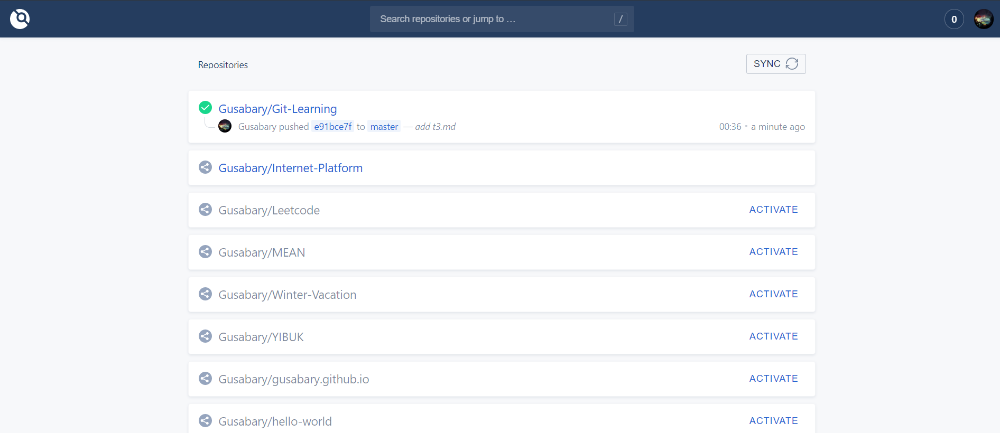

# Hello World of Drone

1. **Create an OAuth Application**

   *Settings -> Developer settings -> OAuth Apps*

   

   replace `Homepage URL` to your own and `Authorization callback URL` to `Homepage URL` + `/login` simply. Then you may get your `client ID` and `client secret`.

2. **Configure and run Drone server**

   Create a `docker-compose.yml`:

   ```yml
   version: '2'
   
   services:
     drone-server:
       image: drone/drone:1.0.0
       ports:
         - 8080:80
       volumes:
         - ./:/data
         - /var/run/docker.sock:/var/run/docker.sock
       restart: always
       environment:
         - DRONE_SERVER_HOST=${DRONE_SERVER_HOST}  #47.100.126.180:8080
         - DRONE_SERVER_PROTO=${DRONE_SERVER_PROTO}  #http
         - DRONE_TLS_AUTOCERT=false
         - DRONE_RUNNER_CAPACITY=3
         # GitHub Config
         - DRONE_GITHUB_SERVER=https://github.com
         - DRONE_GITHUB_CLIENT_ID=${DRONE_GITHUB_CLIENT_ID}
         - DRONE_GITHUB_CLIENT_SECRET=${DRONE_GITHUB_CLIENT_SECRET}
         - DRONE_LOGS_PRETTY=true
         - DRONE_LOGS_COLOR=true
   ```

   then run `docker-compose -f docker-compose.yml up -d` to start server.

   Now you can see a `drone/drone:1.0.0` image and a container based on it running on 8080 port.

3. **Activate your repo**

   Choose a repo to practice and add into it a `.drone.yml`:

   ```yml
   kind: pipline
   name: demo
   
   steps:
   - name: node1
     image: node:11.12.0
     commands:
     - echo "this is testing"
   
   - name: node2
     image: node:11.12.0
     commands:
     - sleep 10
     - echo "sleep 10"
   ```

   then go to your Drone server host (e.g. mine is `47.100.126.180:8080`). Drone may ask for authorization from GitHub at first time, and then you will see like this:

   

   Activate the repo into which you just add the `.drone.yml`.

4. **Hello world**

   Push something to the activated repo and you will see some differences at above interface.

*Reference:* *[official tutorial](<https://docs.drone.io/installation/github/single-machine/>)* and *[lxyl's repo](<https://github.com/linxuyalun/devops>)*.

##### Last-modified date: 2019.5.19, 10 a.m.


